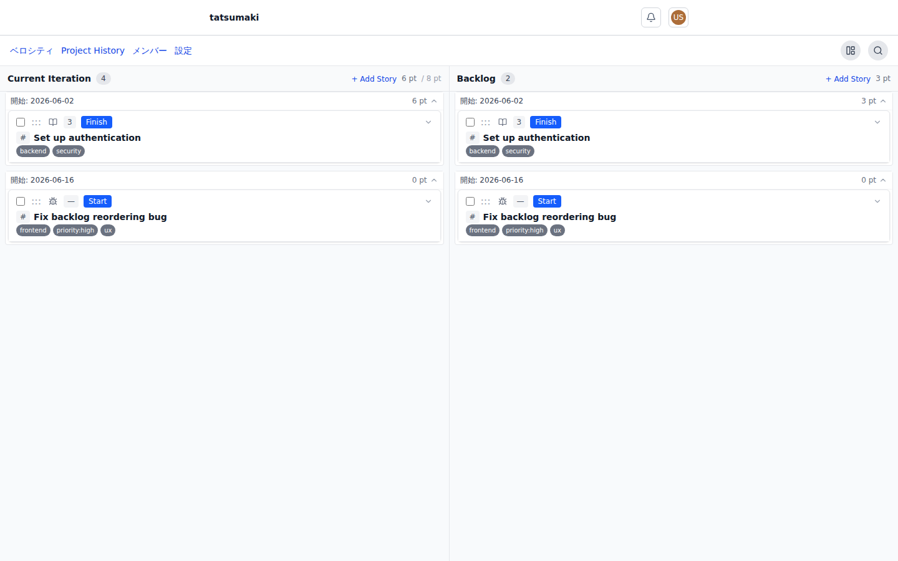
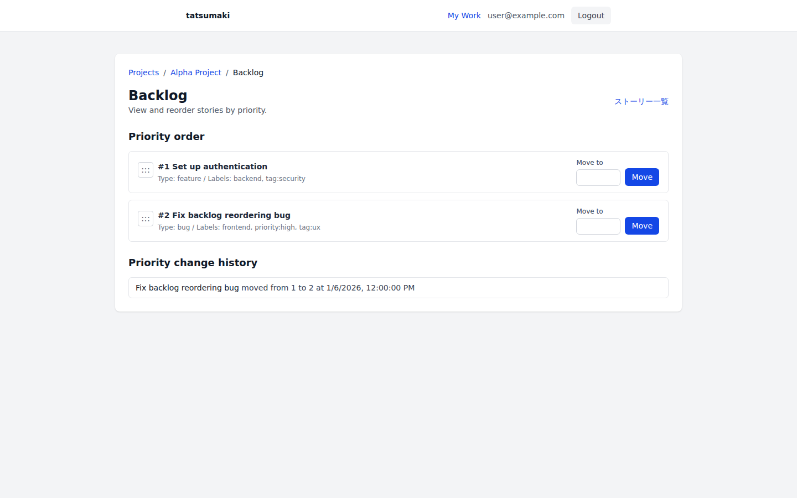
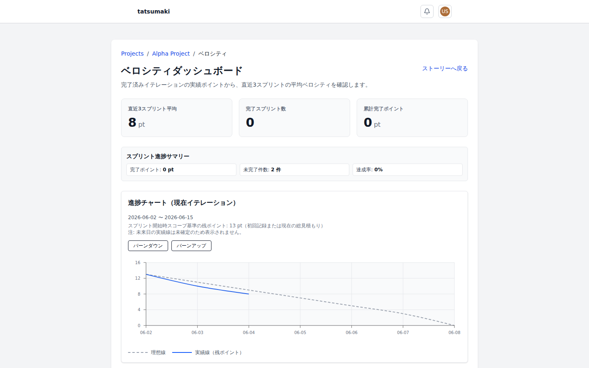
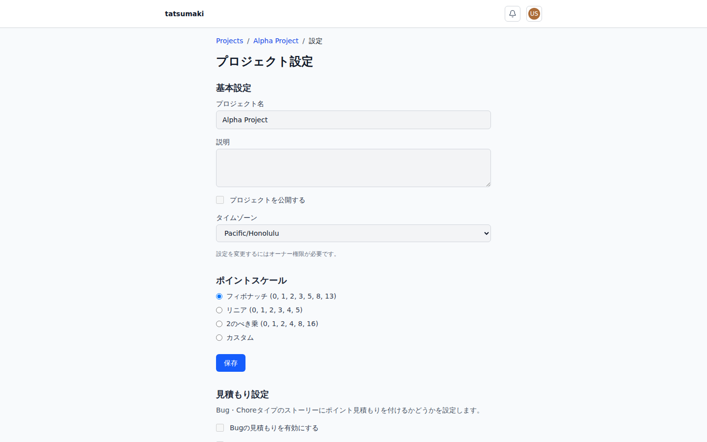
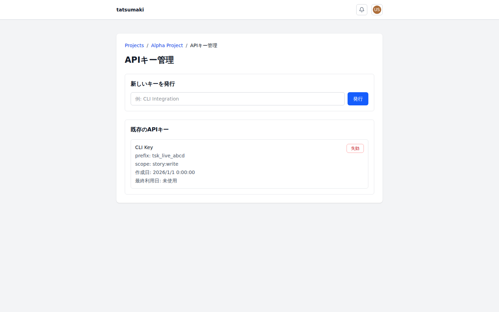

# tatsumaki

[Japanese README](README.ja.md)

tatsumaki is an agile project management tool for small Scrum teams that want a fast, story-centered workflow with point estimation, velocity tracking, and backlog forecasting.

The project is inspired by the workflow strengths of Pivotal Tracker, while being built as self-hostable open source software for modern web, CLI, and automation workflows.

[](https://deploy.workers.cloudflare.com/?url=https://github.com/shwld/tatsumaki/tree/main/apps/web)



## Features

- Manage user stories and tasks, including creation, prioritization, and status transitions.
- Plan iterations and track velocity using a Pivotal Tracker-style workflow.
- Forecast backlog completion from team velocity.
- Use the CLI for local operations and automation.
- Synchronize with GitHub Issues in both directions.

## Current Status

tatsumaki is pre-1.0 software. It is suitable for evaluation, local development, and early self-hosted use, but deployment and operations still expect familiarity with Cloudflare Workers, D1, KV, R2, and Cloudflare Access.

## Screenshots

| Stories | Velocity |
|---|---|
|  |  |

| Project settings | API keys |
|---|---|
|  |  |

## Tech Stack

- **API**: Cloudflare Workers + Cloudflare D1
- **CLI**: `tatsumaki` command
- **Desktop**: Electron viewer shell + CLI refetch IPC

Desktop implementation guide: [docs/desktop-app.md](docs/desktop-app.md)

## Quick Start

```bash
bash .claude/skills/self-hosting-setup/scripts/safe-local-setup.sh
bun run dev
```

Open `http://localhost:8787`. Local development uses `apps/web/wrangler.dev.toml`, including local dev auth as `dev@localhost`.

For an agent-guided setup from local first run through Cloudflare self-hosting readiness, use the repository skill `self-hosting-setup`.

## Self-Hosting Outline

1. Create a Cloudflare Access application for tatsumaki and note its Audience (AUD) tag and team domain.
2. Click the Deploy to Cloudflare button and provide the Access values when prompted.
3. Let Cloudflare provision the Worker resources defined in `apps/web/wrangler.toml`.
4. Configure the production custom domain or route in the Worker dashboard.
5. Confirm that D1 migrations ran during the deploy command.

## Deployment Configuration

`apps/web/wrangler.toml` is committed as the public self-hosting configuration. It defines the Worker entrypoint, compatibility settings, static asset binding, D1/KV/R2/Durable Object binding names, cron trigger, and Durable Object migration. It intentionally does not contain Cloudflare Access values or route settings.

Deploy to Cloudflare uses this repository subdirectory:

```text
https://github.com/shwld/tatsumaki/tree/main/apps/web
```

Use these environment-specific settings:

| Area | Values |
|---|---|
| Variables and Secrets | `ACCESS_AUD`, `ACCESS_TEAM_DOMAIN` |
| Domains & Routes | Production custom domain or route |
| Bindings | `DB`, `OAUTH_KV`, `STORY_ATTACHMENTS`, `USER_AVATARS`, `PLANNING_POKER_DO`, `ASSETS` |

Recommended Cloudflare Workers Builds settings:

| Field | Value |
|---|---|
| Build command | `bun run build` |
| Deploy command | `bun run deploy` |
| Non-production branch deploy command | `bun run deploy:upload` |
| Path | `apps/web` |

The production deploy commands (`bun run deploy` and `bun run deploy:worker`) apply D1 migrations through the `DB` binding before publishing the Worker so schema changes are not skipped. Non-production branch deploys upload Worker versions without running production database migrations.

`ACCESS_AUD` is the Audience (AUD) tag for the Cloudflare Access application that protects tatsumaki. `ACCESS_TEAM_DOMAIN` is the Access team domain, such as `your-team.cloudflareaccess.com`.

Local deploys can use the root helper:

```bash
bun run deploy:web
```

`wrangler.toml` sets `keep_vars = true`, and `deploy:worker` also passes `--keep-vars`, so dashboard-managed variables are preserved across Wrangler deploys.

References:

- [Cloudflare Deploy to Cloudflare buttons](https://developers.cloudflare.com/workers/platform/deploy-buttons/)
- [Cloudflare Workers Builds configuration](https://developers.cloudflare.com/workers/ci-cd/builds/configuration/)
- [Cloudflare Wrangler configuration](https://developers.cloudflare.com/workers/wrangler/configuration/)
- [Cloudflare environment variables and secrets](https://developers.cloudflare.com/workers/configuration/environment-variables/)

## Target Users

tatsumaki is built for Scrum teams practicing agile development.

---

## Development Setup

### Initial Setup

```bash
# 1. Install dependencies. This also registers lefthook Git hooks.
bun install

# 2. Confirm lefthook is available.
bunx lefthook run pre-commit
```

> **Note**: `bun install` runs the root `postinstall`, which synchronizes `.agents/skills/*` symlinks into `.claude/skills/*`. Run `bun run agent-skills:sync` only when syncing manually. The lefthook `postinstall` also registers Git hooks, so a manual `bunx lefthook install` is not required.

### Quality Gates

This repository uses **lefthook** Git hooks for quality gates.

| Timing | Hook | Checks |
|---|---|---|
| `git commit` | **pre-commit** | config-guard for protected configuration, secret files, and destructive operations; conditional `lint:custom`; automatic code formatting |
| `git push` | **pre-push** | config-guard for pushed diffs, then lint -> openapi-check -> test -> typecheck with fail-fast execution |

### Daily Development Workflow

1. **Edit code** as usual.
2. **Commit** with `git commit`; the pre-commit hook runs automatically.
   - Changes to quality gate configuration files such as `lefthook.yml` and `biome.json` are blocked.
   - Secret files such as `.env`, credentials, and key files are blocked.
   - Diffs containing destructive operations, dangerous deletion, or destructive SQL are blocked.
   - `lint:custom` runs only when staged files match `apps/web/src/domain/**/*.ts(x)`.
   - Staged files are formatted with biome.
3. **Push** with `git push`; the pre-push hook runs automatically.
   - config-guard checks the pushed diff again to prevent pre-commit bypasses.
   - `bun run lint`, `bun run openapi:check`, `bun run test`, and `bun run typecheck` run in order.
   - Pushes are rejected unless every check passes.

### Handling Quality Check Failures

#### If pre-commit fails

```bash
# Formatting failure: stage the automatically fixed files, then commit again.
git add -u
git commit

# config-guard block:
# If the change is valid, follow the exception process in docs/config-guard.md.
```

#### If pre-push fails

```bash
# 1. Check which gate failed in the error output.

# 2. Re-run individual checks to isolate the cause.
bun run typecheck      # TypeScript typecheck
bun run lint           # Static analysis
bun run openapi:check  # OpenAPI drift detection
bun run test           # Tests

# 3. Fix the cause, commit the change, and push again.
git add <fixed-files>
git commit -m "fix: ..."
git push
```

#### If a hook blocks the change

Do not use `--no-verify` with `git commit` or `git push`. If config-guard blocks a valid configuration change, follow the exception process in [docs/config-guard.md](docs/config-guard.md).

### Manual Quality Checks

```bash
bun run typecheck      # TypeScript typecheck (tsc)
bun run lint           # Static analysis (oxlint + project custom lint)
bun run lint:custom    # Project custom lint only
bun run test           # Tests (vitest)
bun run format         # Format all files (biome)
bun run format:staged  # Format staged files only
```

### Local UI Verification Seed Data

When you need enough local D1 data for scroll verification, seed dummy data with:

```bash
# Default: 20 projects x 40 stories each
bun run seed:scroll

# Custom count: 3 projects x 300 stories each
bun run seed:scroll 3 300
```

Re-running the command replaces existing seed data with the `seed-scroll-*` prefix.

See [docs/agent-custom-linter-strategy.md](docs/agent-custom-linter-strategy.md) for the custom linter strategy and operations guide.

## Web E2E Strategy

Web E2E tests should prioritize the **accessibility tree with role/name selectors**, with screenshot assertions used as supporting checks. See the [Web E2E strategy guide](docs/web-e2e-strategy.md) for the policy and for the split between agent-generated tests and deterministic CI execution.

### UI Screenshot Diff Workflow

The `ui-screenshot-diff` job in `.github/workflows/ci.yml` runs on every PR and compares key screen screenshots against baseline images. When a diff exists, the job fails and uploads the comparison output as a `ui-screenshot-diff` artifact containing actual, expected, and diff images.

CI does not update screenshot baselines automatically. For intentional UI changes, update the baselines locally and commit the generated images.

Use the [UI screenshot test operations guide](docs/ui-screenshot-test-guide.md) for the standard failure triage process.

### Screenshot Capture Rules

- UI screenshots use **full page screenshots** by default.
- Playwright tests should use `expect(page).toHaveScreenshot(...)` and keep `expect.toHaveScreenshot.fullPage: true` in `apps/web/playwright.config.ts`.
- New UI screenshot tests must follow this setting and compare full pages.
- Do not resolve screenshot diff failures by deleting or skipping tests. Always isolate and fix the cause.

### Local Execution

```bash
bun run playwright:install
bun run test:ui
```

### Baseline Update Procedure

When a UI change is intentional, update snapshots with the following commands and commit the generated images:

```bash
bun run playwright:install
bun run test:ui:update
```

## Sustainability

tatsumaki is developed as open source software. The project is intended to remain self-hostable, while future hosted SaaS offerings may provide managed hosting, operations, backups, updates, and team-oriented convenience features.

If you find tatsumaki useful, you can support ongoing development through GitHub Sponsors.

## Security

Please do not report security vulnerabilities through public GitHub issues. See [SECURITY.md](SECURITY.md) for the private vulnerability reporting process.

## Contributing

Contributions are welcome. Please read [CONTRIBUTING.md](CONTRIBUTING.md) and [CODE_OF_CONDUCT.md](CODE_OF_CONDUCT.md) before opening an issue or pull request.

## License

tatsumaki is licensed under the [Apache License 2.0](LICENSE).
